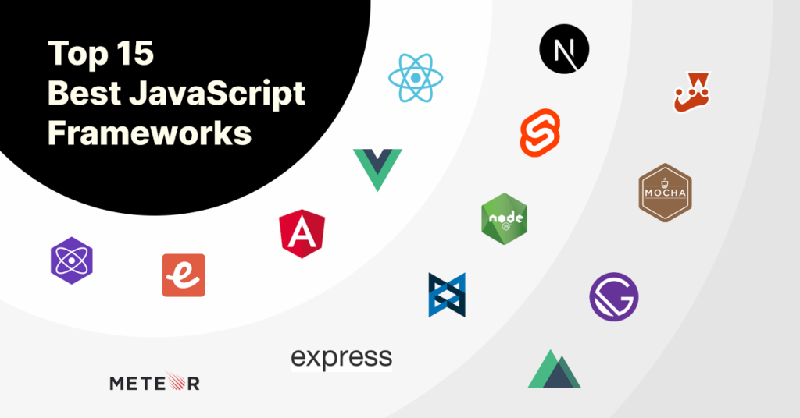
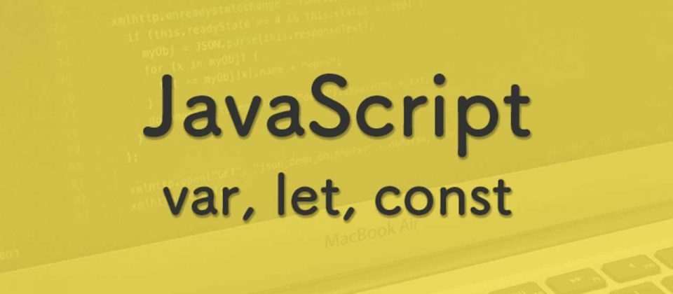

# Javascript
JavaScript — мультипарадигменный 
язык программирования. Поддерживает
объектно-ориентированный, императивный
и функциональный стили. Является реализацией
спецификации ECMAScript. JavaScript обычно 
используется как встраиваемый язык для программного 
доступа к объектам приложений. 
###

# Frameworks 

###
JavaScript-фреймворки являются неотъемлемой частью современной веб-разработки,предоставляя разработчикам проверенные и протестированные инструменты для создания масштабируемых и интерактивных веб-приложений. Многие современные компании используют фреймворки для своих решений, поэтому многие задачи связанные с разработкой клиентской части веб-приложений теперь требуют опыта работы с ними.
###
# WEB DEVELOPMENT FRONT - END
   
##

# Брендан Эйх
Помимо Брендана Эйха в разработке участвовали соосновательNetscape Communications Марк Андрессен и сооснователь Sun Microsystems Билл Джой: чтобы успеть закончить работы над языком к релизу браузера, компании заключили соглашение о сотрудничестве в разработке. Они ставили перед собой цель обеспечить «язык для склеивания» составляющих частей веб-ресурса: изображений, плагинов, Java-апплетов, который был бы удобен для веб-дизайнеров и программистов, не обладающих высокой квалификацией.

Первоначально по предложению Марка Андрессена язык был назван Mocha, был реализован Бренданом Эйхом в течение десяти дней и впервые был включен в пре-альфу версию Netscape 2. Затем он был переименован в LiveScript и предназначался как для программирования на стороне клиента, так и для программирования на стороне сервера (там он должен был называться LiveWire) На синтаксис оказали влияние языки Си и Java, и, поскольку Java в то время было модным словом, 4 декабря 1995 года LiveScript переименовали в JavaScript

# VARIABLES 

###

Ключевое слово var использовалось во всем коде JavaScript с 1995 по 2015 год.

Ключевые слова let и const были добавлены в JavaScript в 2015 году.

Ключевое слово var следует использовать только в коде, написанном для старых браузеров.

# VALUE

# DATA TYPES!!! 

